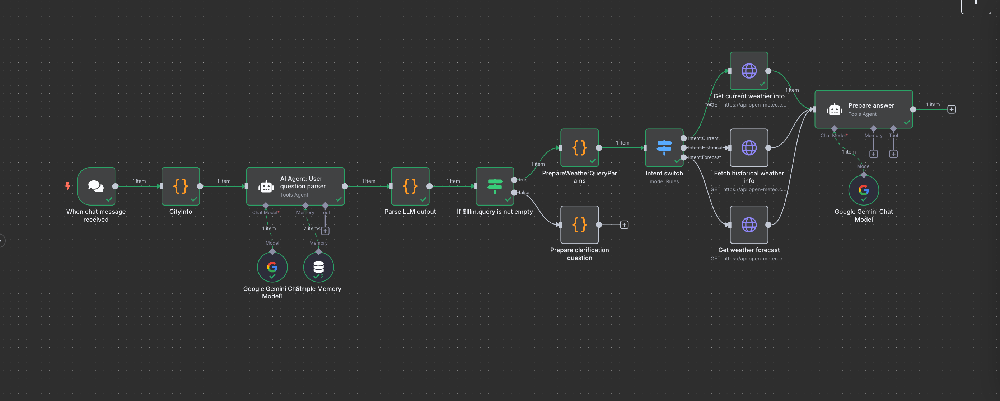

# What is weather assistant workflow?
Weather assistant workflow is a n8n workflow that uses LLM and weather api to answer weather questions.

## Overview

# How does it work?
In brief, it parses user's question, extracts city, time and intent, then calls weather api to get weather data. Finally, it generates a response based on the weather data and intent.

## Nodes
- Trigger: Chat message received
- Provide supported cities info
- LLM to parse user's question and extract city, time and intent
- Parse LLM output to JSON
- Check if there are enough information in the json to call weather api
- If not, ask clarification questions
- Call weather api to get weather data
- Use LLM to generate a response based on the weather data and intent

## Features
- Only 4 cities supported for now
- It can answer weather question for current weather, forecast and historical weather
- It can handle misspelling of city name
- It can handle time in natural language
- It asks clarification questions if it doesn't have enough information to call weather api

## How to use
- make sure you have access to n8n and google gemini api key
- import the workflow json file n8n workflow
- set your Google Gemini api key in n8n credentials
- update city information map in the CityInfo node
- use the chat interface to test the workflow
- alternatively you can add a trigger to your workflow to receive chat messages from other sources
